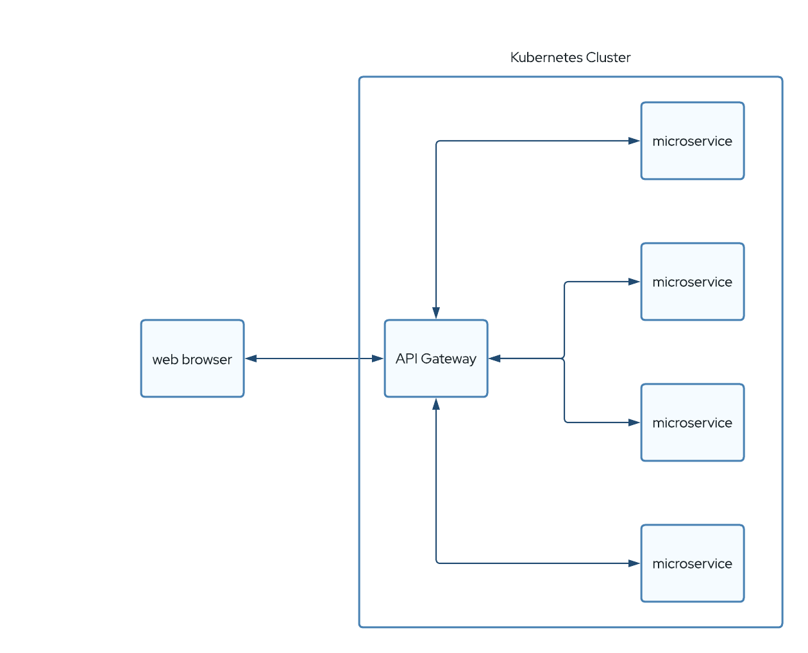

# API Gateway

A service design model — an implementation of the facade design pattern — where a client (e.g. a website) talks to one and only one service: The API Gateway. The API Gateway, in turn, handles all traffic to the other services and then back to the calling client.

An example would be in the case where different clients need different responses from the same service. A website may require a particular snippet of HTML, whereas a mobile client may require a JSON document. By using an API Gateway, you are able to detect the client and direct the request — and handle the response — appropriately.

An API Gateway is also the preferred method for efficiently handling client Authentication for your Cloud Native solution.

As a software developer, the API Gateway model and implementation present the opportunity to put all Circuit Breaker logic in one place.